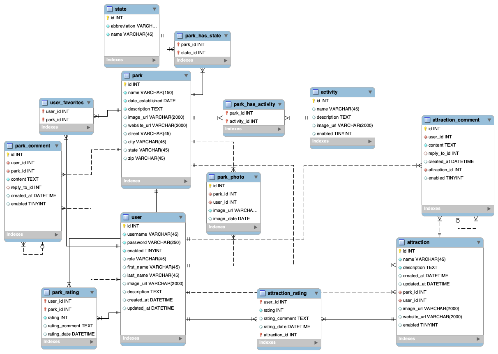

# Final Project - Full-Stack - National Parks Travel App

## Team Members
* Jennifer Kalkowski - Scrum Master
* Patrick Hansen - Database Administrator
* Samantha Addington - Repo Owner

## Objectives

* **What is the End Goal?**

	//TODO NEED TO UPDATE  

* **User Story 1 :**

	//TODO NEED TO UPDATE

	A User that is NOT logged in has the options to: 
	 	* Create a new User Account 
	 	* Login using an existing Account. 
	 	* View National Parks stored in the MySQL Relational Database 
	 	* View a carosel of pictures of Parks stored in the Database  
	 	* View a gallery of User Submitted Pictures of Parks stored in the database. 
	 	* Click the link to view details for existing Parks stored in the Database 
	 	* View The About the Developers page 

* **User Story 2 :** 

	//TODO NEED TO UPDATE

	A Logged in User can:
		* View their Account page
		* View Other Users Account Page
		* Update their Account page Details
		* View a carousel of pictures of Parks stored in the Database
	 	* Click the link to view details for existing Parks stored in the Database 
	 	* Leave Comments or Reply to existing comments on the Park Details page 
	 	* Disable Comments AND Replies they have left on the Park Details page 
	 	* Provide a Rating for Parks 
	 	* Add Parks from the database to a list of Favorite Parks they enjoyed
	 	* Remove Parks from their Favorites List
	 	* Disable their Own Account
	 	* Logout

* **User Story 3 :** 

	//TODO NEED TO UPDATE
	
	A Logged in Admin can: 
		* Perform ALL actions of a Logged in User EXCEPT disabling their own account 
		* View all Users stored in the Database 
		* Disable or Enable Users in the Database 
		* View the Account page of All Users 
		* Disable comments of other users

## Workflow

* **MySql Workbench -> Database Schema -> ER Diagram :**
	

* **JPA & REST -> Paths :**
	//TODO NEED TO UPDATE
	

* **Visual Studio Code -> Angular :**
	//TODO NEED TO UPDATE

## Technologies Used
* Spring Tool Suite - Spring JPA, Spring Boot, Spring REST Framework, Spring Security
* MySQL, CRUD, MySQL Workbench
* Gradle, Dependencies
* HTML, JPA Repositories, POJO, Service, ServiceImpl, JUnit Tests
* Hibernate, Jackson, and other Annotations
* Visual Studio Code - Angular
* Angular - Components, Services, Models, Pipes
* Bootstrap, CSS, ngModel, ngIf, ngFor
* Github, EC2
* Google - Stack Overflow, MDN, MySQL Workbench Manuals, Angular, Spring
* TA help (Thank you!)

## Lessons Learned
* JPA Repositories, REST Controllers
* Spring Security
* Angular with Authentication
* MySQL Workbench
* Most Prominent BrainBlocks
 - Adding a park to a user's list of favorite parks: eventually we figured out that the Join Column and Inverse Join Column were backwards in the Many to Many annotations in the User Entity.
 - 
